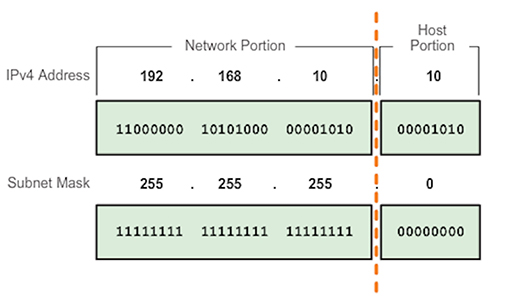

### Welcome to the 3rd Hack The Box Netherlands Meetup

<!--s-->

### Chapter IV : We Start on the Journey

Before continue...

<!--v-->


<!--s-->

```console
[ceso@hogsmeade ~]$ whoami
Leandro (aka ceso)

	- Uruguayan rock climber nerd
	- Linux Sysadmin/DevOps Engineer
	- Cybersecurity enthusiast
	- Cheese lover <3
```

<!--s-->

### My background

<section data-background-image="./images/luna_code.jpg" data-background-size="20%" data-background-position="95% 95%"</section>

- Autodidact
- 5 Years of experience as Linux Sysadmin/DevOps
- RHCSA
- AWS Solutions Architect (Associate)
- OSCP

<!--s-->

### Core concepts

<section data-background-image="./images/core_concepts.jpg" data-background-size="17%" data-background-position="95% 95%" </section>

- Linux: users, groups, basic permissions, special permissions (SUID, SGID, Sticky Bit), process
- Networking: basic subnetting (IP), TCP/UDP, 3-way handshake, short description of DNS, HTTP (error codes, headers)

<!--s-->

### Linux

#### Users and groups

- Users belong to group(s), every user has his own UID (User ID)
- User entries defined inside `/etc/passwd`
- Password of users defined as a hash inside `/etc/shadow`
- Each group has his own GID (Group ID)
- Groups defined inside `/etc/groups`
- They can be obtained as well via LDAP (for example), order of precedence is defined in `/etc/nsswitch.conf`

<!--s-->

### Permissions

They are assigned to users (u), users who belong to a group (g) and others (o).
Every permission is described by a letter:

r -  read
w - write
x - execution

They can be seen as a decimal number as well (between 0 and7), where it number is based on it's binary, for example:

- 0 ---> 000 ---> neither read, write or execution
- 5 ---> 101 ---> read and execution but NO write
- 6 ---> 110 ---> read and write but NO execution

<!--s-->

chmod is the command used to change permissions and works either with rwx or with the binary notation:

- chmod u+rw foo.txt ---> set's read and write on foo.txt for it's user owner
- chmod 601 foo.txt ---> set's read and write for the user owner, doesn't assign permissions for the users belonging to the group owner and sets execution for other users on foo.txt

<!--s-->

To change the user/group owner of a group is used chown, for example:

- `chown ceso:ceso foo.txt` ---> sets the user ceso and the group ceso as owner of foo.txt
- `chown ceso:htb foo.txt` ---> sets the user ceso and the group htb as owner of foo.txt

<!--s-->

### Special permissions

- SUID: Allows to execute a file/program with the permissions of the user owner (for example the command passwd has this permission enabled). if enabled in the user section there is an s instead of an x.

- SGID: Same than SUID, but instead of the file/program running as the user owner, it will do as the group owner (typically found in crontab). If enabled there will be an s instead 
of an x in the group section.

<!--s--> 
- Sticky bit: Used on directories, and makes that only the user owner of a file can delete a file under that directory. For example is used in `/tmp` because every user (normally) is able to write inside it, but only the user owner of the created file is able to delete it. If enabled the section of other will have a t instead of an x.

Always look for binaries with SUID if trying to do privilege escalation!!

<!--s-->

### Process

- Has a file descriptor (FD)
- More files associated with it
- Run as as user X

To see the running process could be used ps or top to check them in real time:

- `ps faux`
- `top -cd1`

<!--v-->

### Networking


<!--s-->

### IP



<!--s-->

### 3-Way TCP-Handshake


<!--s-->

### TCP vs UDP


<!--s-->

### Short description of DNS

- Domain Name Resolution (AKA DNS), is a protocol used to provide an easy way to identifie hosts (IP-Host)
- With a DNS name is possible to associate multiple domains/subdomains (as for example happens in a web page for example) under the same IP, this is called "Virtual Host"
- In Linux the DNS servers are defined in `/etc/resolv.conf`, spefcific host-ip in `/etc/hosts` and order of use in `/etc/nsswitch.conf` 

<!--s-->

Virtual Host example:

```console
www.example.com is associated with the IP 10.10.10.10
blog.example.com is associated as well with the IP 10.10.10.10
```

<!--v-->

### HTTP(S)

- Hypertext Transfer Protocol (AKA HTTP), protocol utilized on web, normally found on the port 80 TCP or 8080 as the alternative one
- It has quite a large surface of attack due how webs are built
- HTTP is an insecure protocol, as the data goes in plain text, while in HTTPs it goes ciphered by using certificates (normally certified by an authority as is GoDaddy, GeoTrust, etc, or free as Let's Encrypt)

<!--s-->

### HTTP Headers


<!--s-->

### HTTP error codes

- Informational responses (100–199)
- Successful responses (200–299)
- Redirects (300–399)
- Client errors (400–499)
- Server errors (500–599)

<!--s-->

Example of HTTP error codes:

- 100 Continue
- 200 OK
- 301 Moved permanently
- 401 Unauthorized
- 504 Gateway Timeout

<!--v-->

### Phases of pentest

- Information: Gathering information about the target, normally by using public tools as google, whois, etc
- Service enummeration: Critical phase and the most important one. Here will be carried things as, network scanning, technologies being used, versions of the software, finding of known public exploits, manual enumeration (for example clicking everything on a web and checking the behaviour), etc

<!--s-->

-  Penetration: In this phase is were the "real" action happens, as you are using all the information you got previously to exploit the vulnerabilities you found by doing enumeration
- Maintaining Access: Once you were able to compromise something, you want to have your foot there, this could implie creation of users, installation of backdoors (for example putting rootkits), malware, etc
- House cleaning: Basically cover your tracks, take care of your ass

I will discuss a bit only the service enumeration and penetration ones!

<!--s-->

### Service enumeration

- Network scanning: the goal is to find ports, protocols being used on the target, for example using nmap

```
nmap --top-ports 100 --open -oA initial-scan 10.10.10.18
nmap -sC -sV -sO -oA full-scan 10.10.10.18
```

<!--s-->

- Manual web exploration (in case web): Click every link on the page, check which actions it cause, if the links work, which pages open, check if is possible to querie `robots.txt` to see if there is some page disallowed for web crawlers, `ctrl + u` and read the code and check if you can spot anything usefull as versions of software used, external scripts, etc
- Brute force directories: using tools as gobuster for example to find interesting files on the web, subdomains

Andddddd...

<!--s-->


<!--v-->

### HTB vs OSCP

On OSCP you will find most of the time a public exploit for a version of the software the target running, so...enumeration, google, exploit, while HTB in the other hand tend to be more missconfiugrations and/or highly CTF stuff, this makes HTB harder than OSCP.

<!--s-->

OSCP is a nice journey to take, specially all the stuff related to pivoting, which is not possible in HTB at all, besides this will forge a strong methodology on how you approach stuff, HTB in it's hand will make you better at spotting missconfigurations, tl;dr: both are complementary, take it's time and extremly fun to do!!

<!--s-->

### Usefull resources

- https://0xdf.gitlab.io/
- https://ippsec.rocks/
- https://ceso.github.io/posts/2020/04/hacking/oscp-cheatsheet/
- https://ceso.github.io/posts/2020/04/a-journey-in-the-dark-an-adventures-tale-towards-oscp/
- https://www.netsecfocus.com/oscp/2019/03/29/The_Journey_to_Try_Harder-_TJNulls_Preparation_Guide_for_PWK_OSCP.html

<!--s-->

### Time to hack...

- Easy: Bashed (Linux)
- Easy: Jerry (Windows)
- Medium: Magic (Linux)

<!--s-->

### HAPPY HACKING!!

<section data-background-image="./images/thanks_fish.jpg" data-background-size="27%" data-background-position="50% 40%" </section>